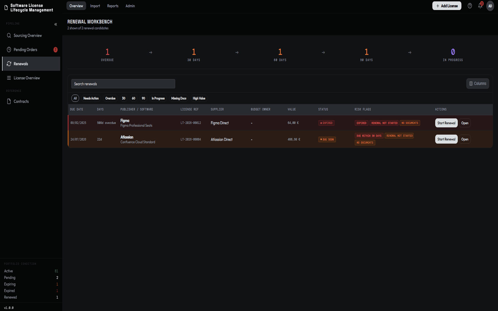
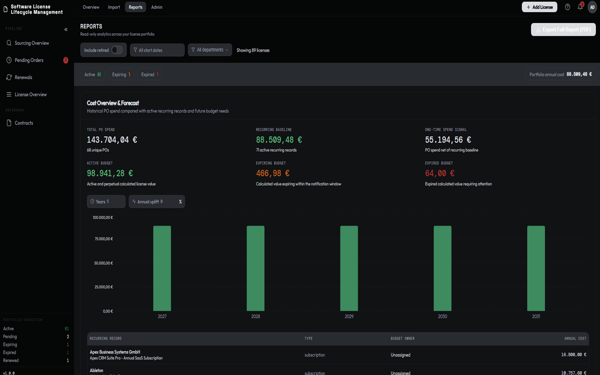

# LicenseTrack

Version 1.1.0.

LicenseTrack is a self-hosted software license procurement and lifecycle management system. It gives organisations a single Docker-deployed application for sourcing, purchase orders, active license records, renewals, contracts, documents, notifications, reporting, database backups, audit history, and user access control.

LicenseTrack is source-available software. See [Licensing](#licensing) before using, modifying, or redistributing it.


[Try the hosted demo](https://zndr88.github.io/LicenseTrack/demo/) before installing.

## Background

LicenseTrack came out of two jobs on opposite sides of the same problem.

The first was at a Value Added Reseller, where I worked as a software consultant. Part of the job was entering quotes in the ERP, printing them for customers, then converting them into purchase orders toward suppliers or publishers. When deliveries came in, required documents were routinely missing or scattered across emails and shared drives. There was no renewal dashboard for customers. Management's answer was Excel. The frustration was not mine alone. The quoting and order-processing team felt it, and so did the consultants working as dedicated customer SPOCs who needed a single source of truth.

The second job was License Manager at an end customer. Same problem, other side of the transaction: requesting quotes from resellers, pushing orders through internal purchasing, receiving entitlements. An ITAM tool was in place for importing purchases, but a general tracking tool and procurement dashboard were missing.

LicenseTrack is what I needed in both roles: a single source of truth for software license procurement, with document storage, automatic email notifications, and clear license logic. It's built to that shape. If that gap sounds familiar inside your own organisation, it should fit yours too.

## What LicenseTrack Does

### Procurement


- Track sourcing requests while license purchases are still being evaluated.
- Record publisher, supplier, contact, quantity, estimated cost, status, renewal context, and quote documents.
- Route zero-cost freeware and open-source requests directly into the Registry
  while retaining the sourcing trail.
- Record included support as a flat coverage fee or per covered unit, or create
  separately tracked maintenance that follows its own purchasing lifecycle.
- Promote sourcing items into pending purchase orders.
- Group multiple items under the same purchase order.
- Convert pending orders into live license records.
- Keep converted and cancelled sourcing requests and pending orders in searchable history views for later price, quote, PO, invoice, and notes reference.
- Detect renewal opportunities and support cotermed renewal workflows.

### License Registry

- Maintain searchable, filterable license records with publisher, contract, purchase order, dates, quantities, costs, status, custom fields, and notes.
- Distinguish zero-cost entitlements from paid support without inventing
  acquisition prices or unnecessary purchase evidence.
- Preserve sourcing-request and purchase-order milestone dates on resulting license records, with manual enrichment for imported and legacy data.
- Review record history in the license detail panel, including creator account, creation timestamp, latest update timestamp, and linked procurement trail records.
- Use status filters for upcoming, active, expiring, expired, pending renewal, renewed, retired, legacy, complete, and incomplete records.
- Configure visible columns from the Registry toolbar or user settings, reorder columns, save user display preferences, and export CSV data.
- Create, edit, retire, renew, and link license records.

### Renewals



- Work upcoming, overdue, and in-progress renewals from a dedicated renewal workbench.
- Start renewals from existing license records and carry data through sourcing, pending order, and conversion workflows.
- Preserve historical license records with renewal-chain traceability.
- Support renewal consolidation where coterm opportunities exist.

### Contracts and Documents

- Manage contract records grouped by publisher and contract number.
- Link contracts to license records.
- Store contract-level documents in user-defined folders.
- Attach invoices, EULAs, proofs of entitlement, quotes, and other files to licenses, contracts, sourcing requests, and procurement records.
- Track completeness based on mandatory fields and required document presence.

### Reporting, Alerts, and Admin



- Configure mandatory fields, legacy handling, and completeness exemptions.
- Use dashboards, reports, CSV import, and CSV exports for operational reporting.
- Send in-app notifications and optional SMTP email alerts.
- Create manual and scheduled database backups.
- Restore the database with a pre-restore database safety snapshot.
- Restore a validated server-side archive directly or upload an off-host
  archive; portfolio recovery archives restore managed documents as well.
- Reset test portfolio data before go-live while preserving users and
  configuration, with an automatic database-and-document recovery archive.
- Manage users with Admin, Editor, and Viewer roles.
- Use optional OIDC/SSO with a protected local break-glass admin account.
- Review audit history for authentication, settings, user, database backup, document, and data-changing actions.

## LicenseTrack and Discovery Tools

LicenseTrack is the procurement and governance layer. It works alongside discovery and compliance tools.

Discovery tools like Flexera, Snow, or Lansweeper are excellent at telling you what is installed and whether it matches what you are entitled to run. LicenseTrack handles what they do not: building and maintaining the complete, structured record of what you actually own, from initial sourcing request through purchase order, invoice, contract, and renewal history, so that record is accurate, evidenced, and ready to act on.

A practical workflow: manage procurement and license governance in LicenseTrack, keep records complete (entitlement certificates, invoices, renewal chain), then feed that data into your discovery tool for compliance reconciliation. LicenseTrack's completeness scoring and mandatory-field configuration exist to help you reach that "ready to export" state.

If you do not yet use a dedicated discovery tool, LicenseTrack works as your central license registry on its own. When you reach the scale where discovery tooling makes sense, your data is already structured and exportable.

LicenseTrack does not scan networks, discover installed software, or reconcile installed deployments against entitlements. It tracks license lifecycle data entered manually, imported through CSV, or added through documented API integrations.

## Extensions And Integrations

LicenseTrack is complete without extensions, AI provider credentials, webhooks, or external integrations. Its support boundary is:

| Surface | Support status |
| --- | --- |
| Core LicenseTrack workflows | Supported as part of LicenseTrack. |
| Official Extensions published and signed by the LicenseTrack project | Supported when installed from official LicenseTrack release channels. The host is disabled by default. |
| Public API, webhook, and sidecar contracts | Supported integration contracts; each integration remains operated, tested, and maintained by its owner. |
| Unofficial or third-party in-process packages | Not supported. LicenseTrack does not accept arbitrary third-party packages as trusted application code. |

Official Extensions run as trusted server code. Package permissions describe intended host access; they are not a hostile-code sandbox or a security boundary. For custom or third-party automation, use the documented API, webhook, and sidecar framework in [docs/extension-authors/overview.md](docs/extension-authors/overview.md).

The internal Official Extensions host is maintainer-facing and requires an explicit deployment opt-in plus pinned LicenseTrack release public keys. Its internal package contract is documented under [docs/plugin-authors/](docs/plugin-authors/) for first-party maintainers, not as a public third-party plugin SDK. Deployment constraints are covered in [wiki/operations/deployment.md](wiki/operations/deployment.md).

## Tech Stack

| Layer | Technology |
| --- | --- |
| Frontend | React 19, Vite, TanStack Query, React Hook Form, Zod, Recharts, Vitest, Playwright |
| Backend | FastAPI, SQLAlchemy async, Alembic, Pydantic |
| Database | SQLite with `aiosqlite` |
| Auth | JWT sessions, bcrypt password hashing, optional OIDC |
| Documents | Filesystem-backed storage under the configured storage path |
| Jobs | APScheduler background scheduler |
| Deployment | Docker and Docker Compose (Podman-compatible) |

## Quick Start

The shortest production-style local setup uses Docker Compose:

```bash
cp .env.example .env
```

Set a strong `JWT_SECRET` and `ADMIN_PASSWORD` in `.env`, then start LicenseTrack:

```bash
docker compose up -d --build
```

Open `http://localhost:8080` and sign in as `admin` with the password from
`.env`. LicenseTrack rejects blank or common default secrets.

See the [installation guide](wiki/getting-started/installation.md) for secret
generation and first-login guidance. Before exposing an instance to a network,
follow the [deployment and hardening guide](wiki/operations/deployment.md).

### Native Linux installation

LicenseTrack can also run directly on a supported systemd-based Linux host
without Docker. Download and extract the
`licensetrack-native-<version>-linux-x86_64` release archive, then run:

```bash
sudo ./install.sh
```

The [native installation guide](wiki/getting-started/native-installation.md)
contains the supported host matrix, network modes, filesystem and privilege
model, unattended options, and source-archive prerequisites. Upgrade, backup,
diagnostic, and removal procedures live in the operator documentation rather
than on this landing page.

## Documentation

- Public operator docs: [LicenseTrack documentation](https://zndr88.github.io/LicenseTrack/docs/) and the source pages under [wiki/](wiki/).
- Deployment and operations: [deployment](wiki/operations/deployment.md), [native installation](wiki/getting-started/native-installation.md), [upgrade](wiki/operations/upgrade.md), [native upgrade](wiki/operations/native-upgrade.md), [runbook](wiki/operations/runbook.md), and [backup/restore](wiki/operations/backup-restore.md).
- Release numbering: [versioning policy](VERSIONING.md).
- Maintainer docs: [docs/maintainer/architecture.md](docs/maintainer/architecture.md) and [docs/maintainer/style-contract.md](docs/maintainer/style-contract.md).
- Extension author docs: [docs/extension-authors/](docs/extension-authors/).
- Internal Official Extension maintainer docs: [docs/plugin-authors/](docs/plugin-authors/).
- [THIRD_PARTY_NOTICES.md](THIRD_PARTY_NOTICES.md): human-readable direct dependency license summary.

Version-local Help Center content is bundled in the frontend;
[docs/in-app-help/](docs/in-app-help/) records its ownership and maintenance
boundary. It is not the public documentation site.

## Development

Start with the [maintainer documentation](docs/maintainer/README.md), especially
the [architecture map](docs/maintainer/architecture.md) and
[style contract](docs/maintainer/style-contract.md). Backend and frontend
dependencies and scripts are recorded beside their respective projects.

## Licensing

LicenseTrack is distributed under the LicenseTrack Source-Available License. See [LICENSE](LICENSE).

In short, the license allows internal self-hosted use, private internal modifications, implementation services, and independent integrations/extensions. A separate commercial license is required for hosted services, managed services, tracking third-party licenses, commercial distribution of derivative works, or incorporation into a commercial product.

LicenseTrack uses a source-available license, not an OSI-approved open source license.

Third-party dependencies remain governed by their own license terms. See [THIRD_PARTY_NOTICES.md](THIRD_PARTY_NOTICES.md).
