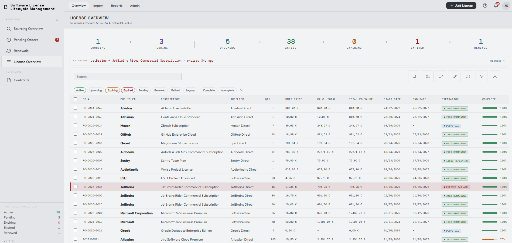
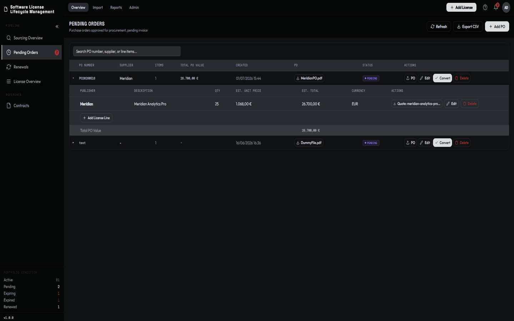

# LicenseTrack

Version 1.1.13.

LicenseTrack is a self-hosted software license procurement and lifecycle
management system. It helps organisations track software requests through
sourcing, purchasing, entitlement, renewal, and retirement.

LicenseTrack does not replace an ERP or ordering system. It provides the single
source of truth and audit trail that general ordering tools usually do not.

LicenseTrack is source-available software. See [Licensing](#licensing) before
using, modifying, or redistributing it.



> [!TIP]
> [Try the hosted demo](https://zndr88.github.io/LicenseTrack/demo/) before
> installing.

## Background

LicenseTrack came out of two jobs on opposite sides of the same problem.

The first was at a Value Added Reseller, where I worked as a software
consultant. Tracking quotes, orders, and entitlement documents was fragmented.
Required documents were routinely missing or scattered across emails and
shared drives. There was no renewal dashboard for customers. Management's
answer was Excel.

The second job was in License Management. Same problem, other side of the
transaction: requesting quotes from resellers, pushing orders through internal
purchasing, and receiving entitlements. An ITAM tool was available for
importing purchases, but a general tracking tool and procurement dashboard were
missing.

LicenseTrack is what I needed in both roles: a single source of truth for
software license procurement, with document storage, optional email
notifications, and clear license lifecycle logic. It is deliberately built
around that workflow.

## What LicenseTrack Does



- Tracks requests, quotes, suppliers, costs, and documents through sourcing and
  pending orders.
- Converts completed purchases into active license records while preserving
  their procurement history.
- Handles paid licenses, freeware and open-source entitlements, included
  support, and separately purchased maintenance.
- Maintains a searchable license registry with custom fields, completeness
  checks, documents, contracts, secondary renewal contacts, and audit history.
- Governs companies and cost centres as canonical reference data with aliases,
  role-aware selection, safe merges, and synchronized display names.
- Carries renewals through sourcing and purchasing while preserving the license
  chain, supporting coterm opportunities, and adopting an already-purchased
  same-PO license as the successor when appropriate.
- Provides CSV import and export, including mapped imports from external tools,
  reference-data review, legacy-unlinked maintenance recovery, shared PO-value
  overrides, perpetual-maintenance and purchase-order trackers, operational
  spend and forecast reports, in-app notifications, and optional SMTP alerts.
- Supports Admin, Editor, and Viewer roles, with optional OIDC/SSO and a local
  break-glass administrator.
- Includes scheduled backups, restores from server-side or uploaded archives,
  and a guarded portfolio reset for clean pre-production starts.

## Product Boundary

LicenseTrack is the procurement and governance layer. It can act as a central
license registry on its own or work alongside discovery and compliance tools
such as Flexera, Snow, or Lansweeper.

It does not scan networks, discover installed software, or reconcile
deployments against entitlements. It keeps the structured, evidenced record of
what was requested, purchased, received, maintained, and renewed so that data
can be governed in LicenseTrack or exported for compliance reconciliation.

## Quick Start

LicenseTrack is a web application accessed through a browser. The shortest
production-style local setup uses Docker Compose:

```bash
cp .env.example .env
```

Set a strong `JWT_SECRET` and `ADMIN_PASSWORD` in `.env`, then start
LicenseTrack:

```bash
docker compose up -d --build
```

Open `http://localhost:8080` and sign in as `admin` with the password from
`.env`. LicenseTrack rejects blank or common default secrets.

See the [installation guide](wiki/getting-started/installation.md) for secret
generation and first-login guidance. Before exposing an instance to a network,
follow the [deployment and hardening guide](wiki/operations/deployment.md).

### Native Linux

LicenseTrack can also run directly on a supported systemd-based Linux host.
Download and extract the
`licensetrack-native-<version>-linux-x86_64` release archive, then run:

```bash
sudo ./install.sh
```

See the
[native installation guide](wiki/getting-started/native-installation.md) for
supported hosts, network modes, unattended installation, upgrades, diagnostics,
and removal.

## Documentation

- [Operator documentation](https://zndr88.github.io/LicenseTrack/docs/)
- [Installation](wiki/getting-started/installation.md) and
  [deployment](wiki/operations/deployment.md)
- [Docker upgrade](wiki/operations/upgrade.md),
  [native upgrade](wiki/operations/native-upgrade.md), and
  [backup and restore](wiki/operations/backup-restore.md)
- [API, webhook, and sidecar integrations](docs/extension-authors/overview.md)
- [Maintainer documentation](docs/maintainer/README.md) and
  [versioning policy](VERSIONING.md)

Version-local guidance is also available from the Help Center inside
LicenseTrack.

## Extensions and Integrations

LicenseTrack is complete without extensions or external integrations. Support
for signed Official Extensions is built in, but no Official Extensions have
been published yet. The first extensions, including document processing, are
currently in development. The extension host remains disabled by default.

Custom and third-party automation should use the documented API, webhook, and
sidecar contracts. Arbitrary third-party in-process packages are not supported.
See the [integration overview](docs/extension-authors/overview.md) and
[Official Extension trust model](docs/plugin-authors/plugin-host-v1-contract.md).

## Project Direction

LicenseTrack is under active development. The current focus is strengthening
the 1.1.x foundation, preparing the first Official Extension for document
processing, and expanding native Linux validation.

Delivered changes are recorded in the [changelog](CHANGELOG.md). Planned
release work is tracked through the project's
[GitHub milestones](https://github.com/zndr88/LicenseTrack/milestones).

## Technology

LicenseTrack uses a React 19 frontend, a FastAPI and async SQLAlchemy backend,
SQLite, and filesystem-backed document storage. It can be deployed with Docker
Compose, Podman, or as a native systemd service. See the
[architecture overview](docs/maintainer/architecture.md) for the detailed
module map.

## Development

Start with the [maintainer documentation](docs/maintainer/README.md), especially
the [architecture map](docs/maintainer/architecture.md) and
[style contract](docs/maintainer/style-contract.md). Backend and frontend
dependencies and commands are recorded beside their respective projects.

## Licensing

LicenseTrack is distributed under the LicenseTrack Source-Available License,
not an OSI-approved open source license. See [LICENSE](LICENSE).

The license allows internal self-hosted use, private internal modifications,
implementation services, and independent integrations or extensions. A
separate commercial license is required for hosted or managed services,
tracking third-party licenses, commercial distribution of derivative works, or
incorporation into a commercial product.

Third-party dependencies remain governed by their own license terms. See
[THIRD_PARTY_NOTICES.md](THIRD_PARTY_NOTICES.md).
