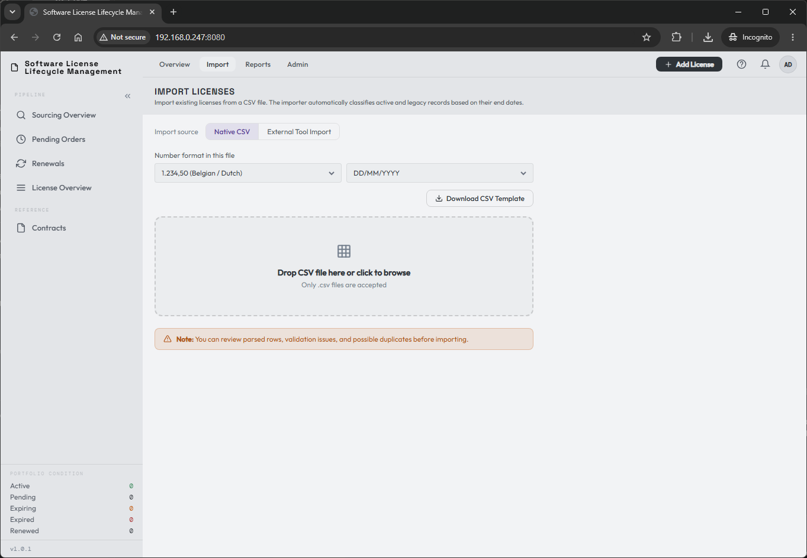
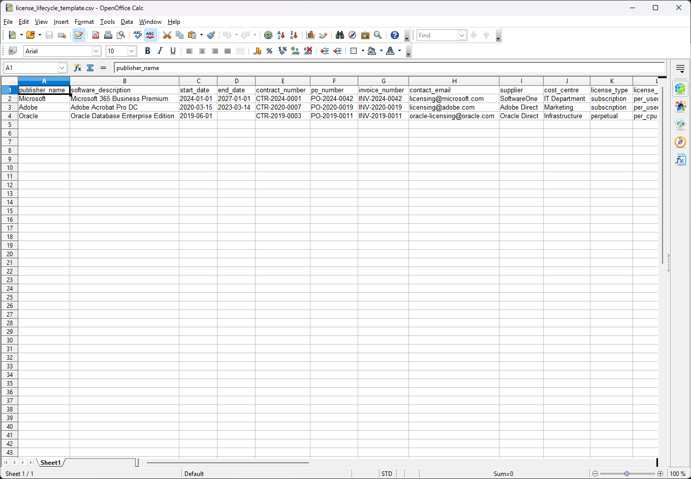
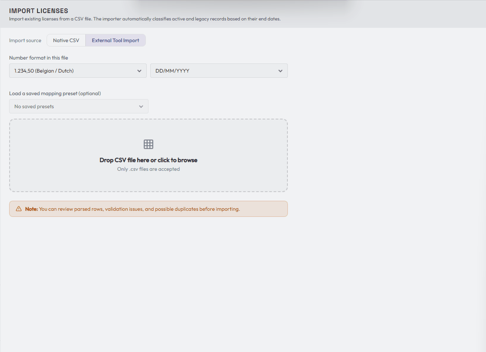
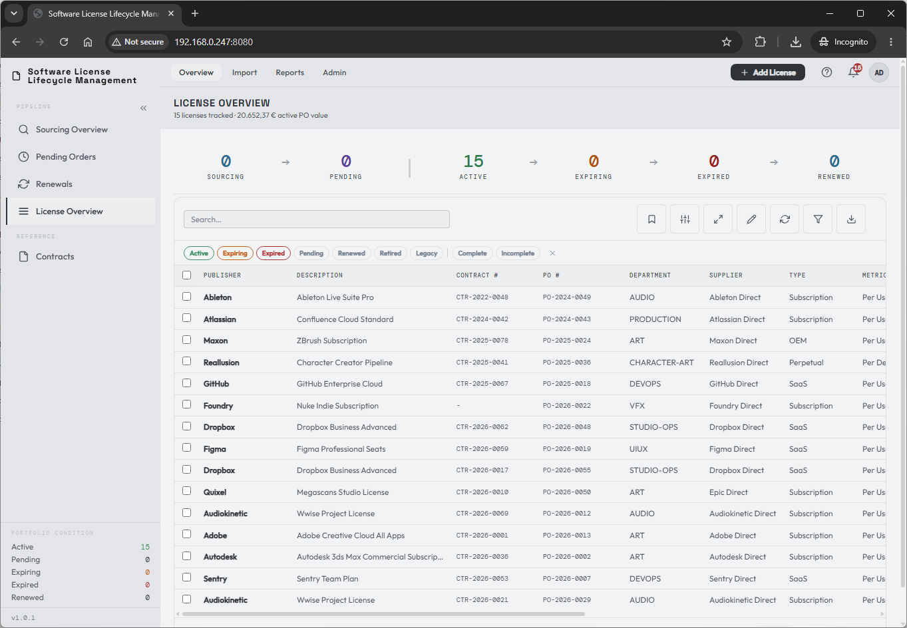

# You're in! Now what?

Chances are you already have software licenses to manage, so this blank canvas won't stay blank for long.

LicenseTrack is designed to easily import existing spreadsheets, or to convert custom spreadsheets into its format. Navigate to **Import**:

## Start from the template

Select your desired settings, download the template, and review it:

As you can see, it comes with three pre-filled lines that give you an idea of how LicenseTrack handles its data.

The import number format defaults to your personal **Number Format** setting.
Leave it unchanged when the file uses the same separators, or select the
matching example for this file:

- `1,234.50`
- `1.234,50`
- `1 234,50`

The override belongs to the import, not to your account. This lets you import a
supplier or legacy spreadsheet that uses different separators without changing
how LicenseTrack displays numbers elsewhere.

The same import settings also apply to date parsing. Native and mapped imports
accept ISO dates or the date format selected for the file, including custom date
fields. Far-future end dates such as `1-1-2099` are treated as a perpetual
license signal instead of blocking the row.

You have two ways to get your data in:

- **Use this template** to migrate your own license data into the known default format, or
- **Use the "External Tool Import" source** to bring in your own custom file, then save the configuration as a preset once you've mapped it.

When a file contains an **LT Ref** column, either path offers an auto-enabled option to update the current matching license instead of creating a duplicate. This makes it safe to export a list, make small spreadsheet corrections, and re-import it. Turn the option off when you intentionally want new records.

If you open a LicenseTrack CSV export in Excel, adjust values, and save it
again, the importer tolerates the common spreadsheet changes to quoting,
delimiter hints, line endings, and localized number formatting. Select the
number format that matches the saved file before previewing so prices and
quantities are interpreted correctly.

Native Import also recognizes existing custom fields. **Export Full Data** writes their stable `cf_*` keys as headers, so custom values round-trip automatically. Files that use the custom field's display name are also matched when that name identifies one field unambiguously. During an LT Ref update, a nonblank custom-field value is patched and a blank cell preserves the value already stored.

The native template and manual mapping include the current LicenseTrack fields,
including request date, purchase date, procurement reference, parent LT Ref, and
secondary contacts. For external exports with several owner email columns, map
the primary owner to **Budget Owner** and any additional people who should be
copied on renewal emails to **Secondary Contacts**. That target can accept more
than one source column.

Some external tools expose both a purchase quantity and a quantity-per-unit
value. Use the purchased entitlement count for **Purchase Quantity**. A
quantity-per-unit value, such as a bundle size or lines-of-code pack size,
maps to **Quantity per Unit**. LicenseTrack derives **Effective Quantity** as
Purchase Quantity multiplied by Quantity per Unit, and uses Purchase Quantity,
not Effective Quantity, for price calculations.

Flexera exports may include **Effective Quantity**, **Purchase Quantity**, and
**Quantity per Unit**. Map Purchase Quantity to the native Purchase Quantity
field and Quantity per Unit to the native Quantity per Unit field. If an export
only has Purchase Quantity and Effective Quantity, LicenseTrack can derive
Quantity per Unit during import when the numbers are valid.

Flexera exports can use **Purchase Type** values that do not exactly match
LicenseTrack's labels. Common values are normalized during import: Software
Subscription becomes Subscription, Software Maintenance becomes Maintenance,
Software Baseline and Software become Perpetual, and Service becomes Service.
Metric values such as Named User, SaaS User, Concurrent User, Device,
Microsoft Server Core, Processor, and Processor Points also map to native
LicenseTrack metrics. Custom Metric, Unknown, and Other map to
**Other / Unknown** so uncommon metrics can be reviewed after import instead
of blocking the file.

Flexera-style boolean columns such as **Includes Maintenance**, **Purchase
Includes Maintenance**, or **Purchase Includes Support** can map to
**Maintenance / Support Coverage**. True-like values become **Included**;
false-like or blank values leave the coverage unset so LicenseTrack can apply
the normal default for the license type.

For perpetual, OEM, or freeware rows with included support, imported
**Effective Date** and **Expiry Date** become support coverage dates while the
license record itself remains non-expiring. If no support-cost column is
mapped, LicenseTrack defaults **Total Support Cost** from the line total and
shows a warning so you can verify it is not the original perpetual acquisition
value.

Separately tracked maintenance imports need one explicit parent reference, or a
clear parent that LicenseTrack can infer earlier in the same file. Import
creates that primary parent link. If the preview cannot resolve the parent,
choose an existing eligible parent license from the row action before importing.
If one maintenance renewal covers several perpetual, OEM, or
freeware/open-source records, add the additional parent links from the parent
license's **Maintenance & Support** section after import.

Some external exports contain a generic **Item** column as well as a more exact
software description column. LicenseTrack treats Item as a fallback only. If
your file has **Software Description**, that value wins; if duplicate recognized
columns are present, the extra columns stay available for manual mapping.

## Mapping a custom file

Below is an example of a custom file that matches the template and also includes a unique field. You can map it to an existing **custom field**; admins can create a new definition when one does not exist:

## Review your imported licenses

Once imported, the licenses appear in the **License Overview** page:

This is a good opportunity to help you understand the license record as it exists in LicenseTrack.

[:material-arrow-right: Understanding the license record](license-record.md)

