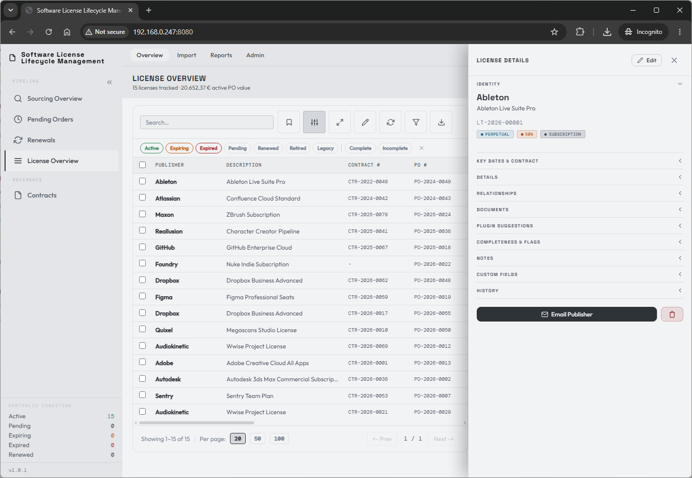
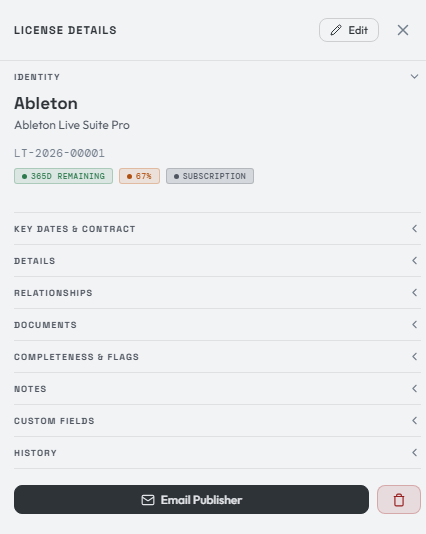
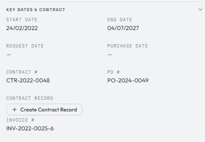
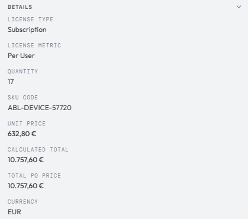
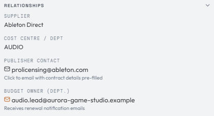
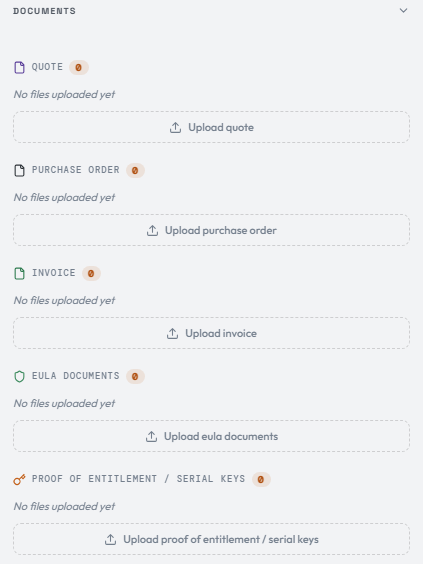
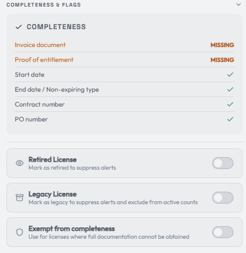
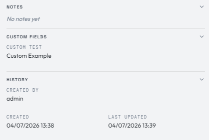
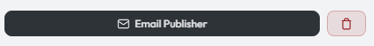
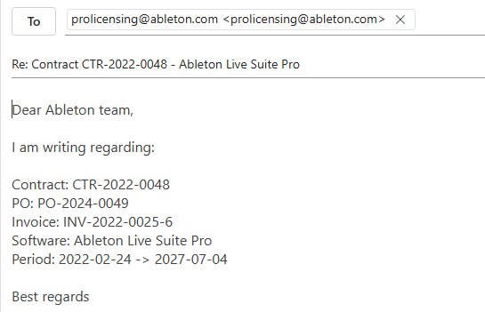

# Understanding the license record

Clicking a license in the overview opens the **License Details** panel:

The License Details panel holds all the data of your license record.

The **Identity** section is the main view, always visible at the top. It holds key information such as the publisher identity, the license description, and the unique LicenseTrack identifier number.

It also shows three flags: **days remaining until expiration**, a **completeness score** (more on that below), and the **license type**.

The record is organized into the following sections:

- Key Dates & Contract
- Details
- Maintenance & Support
- Relationships
- Documents
- Completeness & Flags
- Notes
- Custom Fields
- History

Let's walk through each one.

## Key Dates & Contract

Here you'll find the important dates for your license purchase. The **start**
and **end** dates represent the license lifecycle. **Request date** is filled
when a license originates from sourcing, including direct freeware conversion.
**Purchase date** is filled only when a pending order exists. Together they give
you a clear reading of the path the entitlement followed.

**Notice date** is an optional manually entered contractual notice deadline,
for example the last date to cancel or change renewal terms. It is independent
from the license end date and is not calculated automatically. LicenseTrack
warns if the notice date is after the end date, but it does not block saving.

Your **PO number**, **invoice number**, and — if required — **contract number** are shown in this section. You can also link the license to a dedicated contract from here. More on that later.

A license can have more than one invoice number. Click the invoice number or the add control to manage the invoice-number list. The first invoice number is the primary invoice shown in the overview table and exports.

## Details

Here you'll find more detail about the license record: the **license type**, **metric**, **quantity**, **SKU code**, and **pricing**.

The **calculated total** is quantity × unit price, computed automatically. The
**total PO price** is the acquisition value of the whole purchase order, which
may span multiple lines in a single PO. Freeware/open-source records have no
acquisition price; paid support is recorded in **Maintenance & Support**.

## Maintenance & Support

Perpetual, OEM, and freeware/open-source records classify support as
**Unknown**, **Not applicable**, **Included**, or **Separately tracked**.

Included support stays on the parent license. Its start/end dates define the
coverage period, and its price is either one flat fee or a covered quantity
multiplied by a support unit price. The resulting support cost is the total for
that coverage period, not an automatically annualized amount.

Separately tracked support uses its own linked maintenance license, procurement
evidence, cost, dates, and renewal lifecycle. The parent shows the active
maintenance line's current dates and cost for convenient review.

## Relationships

Here you'll find the **supplier** (where you purchased the license), the internal **cost center or department** the license is for, your **contact** at the publisher, and the internal **budget or department owner**.

The budget owner receives automated renewal notifications, if enabled.

## Documents

In this section you can upload any document related to the purchase cycle of a software license — quick, easy access to the quote, PO, invoice, entitlements, and EULA files.

!!! note
    Keep more detailed contract data out of this section. Upload contract files to the dedicated **Contracts** page instead.

## Completeness & Flags

Each purchase has a **completeness score**. The completeness requirements are defined by the admin under settings. In this example, the invoice, proof of entitlement, start and end date, contract number, and PO number are all required for a license to count as **complete**. Admins can also include notice date when contractual notice tracking is part of their housekeeping goals.

For a freeware/open-source record, EULA, proof-of-entitlement, and
publisher-contact requirements do not apply. Contract, PO, invoice, and quote
requirements also do not apply unless the record includes paid support.
Department and budget-owner requirements remain useful and continue to apply
when enabled.

Licenses that are not marked complete generate email notifications, and you'll see alerts in the top-right menu.

You can also mark a license as **retired** or **legacy**, or **exempt** it from completeness entirely to suppress the alerts.

The **Renewal notifications** toggle controls expiry emails for this specific license. It is enabled by default. Turn it off when a license is still active but should not send renewal emails, for example because renewal discussions have already started.

## Notes, Custom Fields & History

- **Notes** — add custom messages to the license for follow-up.
- **Custom Fields** — hold values that have no natural place in the other sections. You define a custom field and its section under the admin menu.
- **History** — an audit trail of changes to the record, plus links back to the sourcing request and, when one exists, the pending order that created the license.

When a procurement trail exists, the History section can take you back to the original quote-stage sourcing line and the related pending order. Converted or cancelled procurement records open in their history tables, so you can inspect old quote, PO, invoice, price, and note context without reopening the workflow.

## Email & delete

At the bottom of the panel are the **Email Publisher** and **Delete** buttons.

!!! danger "Delete is permanent"
    Delete removes the license. There is no recovering a deleted license unless you have made a database backup.

The **Email Publisher** button opens your default email program and pre-fills the message with the important license data:

You can achieve the same result by clicking the publisher's email address under the **Relationships** section.

[:material-arrow-right: Renewal &amp; the license lifecycle in action](renewal-lifecycle.md)

