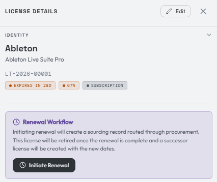
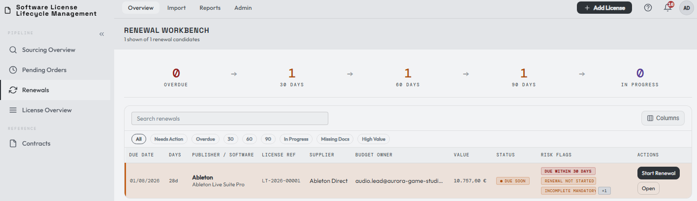
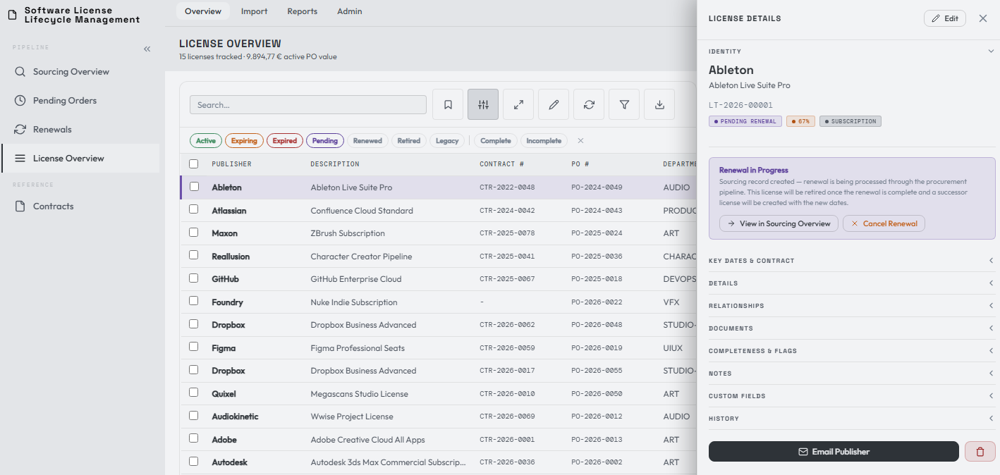
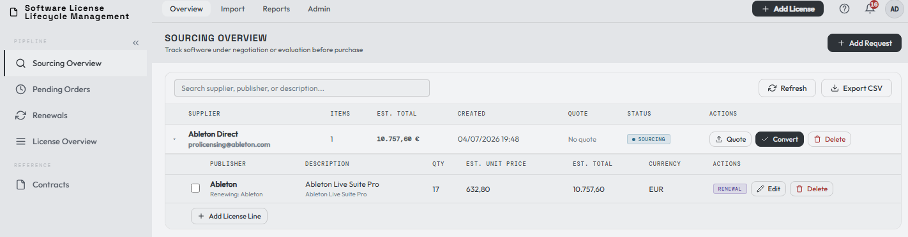
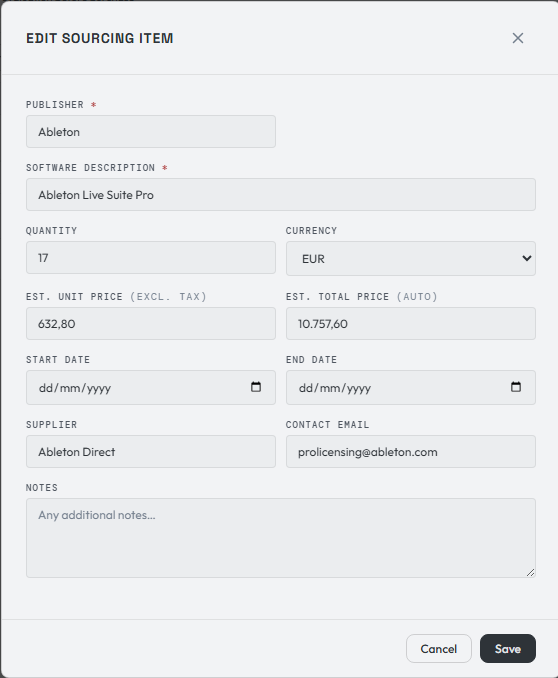
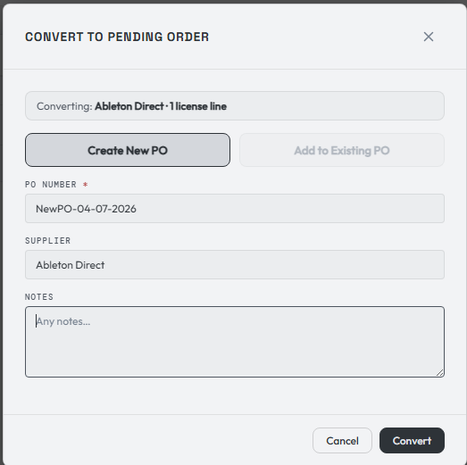
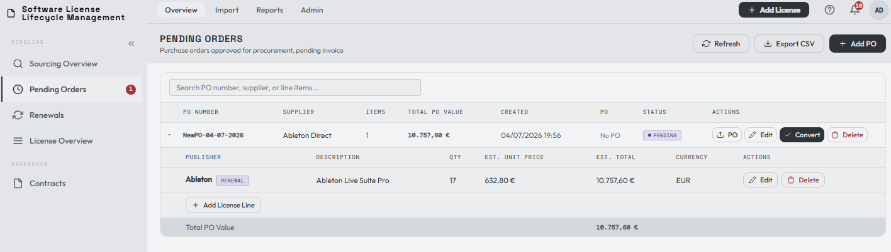
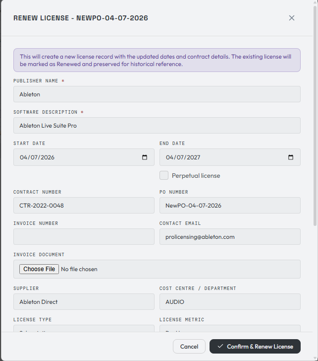
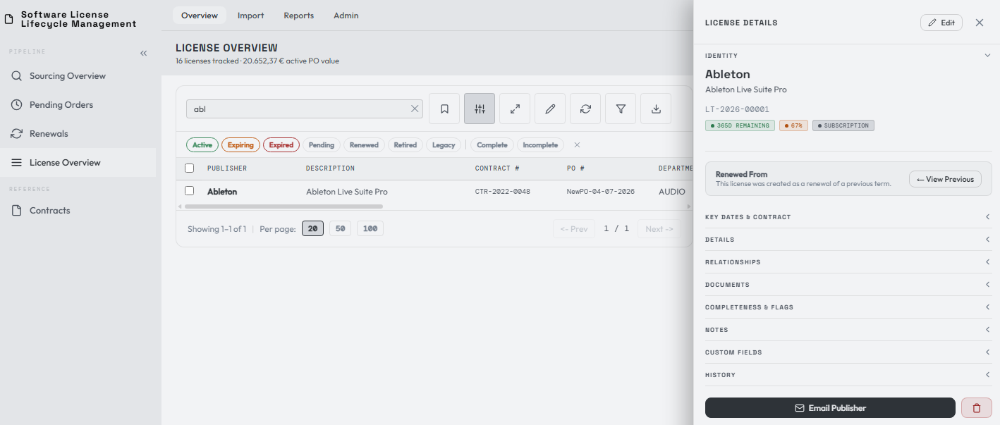

# Renewal & the license lifecycle in action

So far you've imported licenses and learned the record. Now let's walk through what LicenseTrack is really built for: the **renewal lifecycle** — taking an expiring license from an alert all the way to a fresh active record, with sourcing and procurement handled along the way.

For this example I changed the expiration date of our Ableton license so that it falls **28 days from now** — inside the "expiring within 30 days" alert window.

## The renewal workflow appears

Once a license is inside the alert window, the renewal workflow activates. An **Initiate Renewal** button appears in the License Details panel, and the license shows up in the **Renewal Workbench**.

From either view you can start the renewal, provided all conditions are met.

!!! note "A budget owner is required"
    You can't start a renewal until the license has a **budget owner** assigned (under the Relationships section). The budget owner is who the renewal is routed to.

## Initiate the renewal

Pressing **Initiate Renewal** changes the Ableton license status from **active** to **pending**, signalling that there's an open action on this license.

At the same time, a new record is created in the **Sourcing Overview** page.

## Source and quote

The sourcing record is pre-populated with information from the previous license. When you receive a quote from your supplier, update the record with the current figures and attach the quote to the item. Once it's filled in, convert it to a **purchase order**.

When converting, you can attach the item to an **existing PO** or **create a new one**.

After conversion, the sourcing request leaves the active Sourcing Overview table and remains available through the **History** button. Sourcing history opens as a second read-only table below active sourcing work. It keeps the old request id, line id, quote evidence, supplier, pricing, and notes, and it can link forward to the related pending order.

## Pending orders

Once converted, the item clears out of sourcing and enters the **Pending Orders** phase.

Here you can still edit the PO or the line items in case of a last-minute adjustment, and attach the official PO document. For this example we'll convert it as-is into a new active license.

You get a chance to review the purchase and upload the received invoice, if you already have it. **Confirm and Renew** completes the action.

After conversion to licenses, the pending order leaves the active Pending Orders table and remains available through the **History** button. Pending-order history is also read-only. It keeps the PO id, line ids, PO document, carried-forward quote context, invoice evidence, and links to the license records created from each line.

## The lifecycle closes

The new record becomes the **active** license. The previous record — which was in the pending state — is marked **renewed**.

Looking the license up in the License Overview, you'll see the historical link back to the previous term via **View Previous**.

The renewed license's **History** section also shows the procurement trail when the renewal passed through LicenseTrack sourcing and pending orders. From there you can jump back to the historical sourcing item, then through to the historical PO, and finally back to the created license. This is useful when an old renewal is restarted months later and you need the previous quote, notes, or PO evidence for reference.

!!! info "About the LT-Reference number"
    You might notice the LT-Reference number is unchanged. A license keeps a single unique identifier for its whole life — on renewal in future years the **year** in the reference changes, but the identifier number does not. Because this is an example renewal within the same year, both records show the same year.

That completes the license lifecycle renewal — from expiry alert, through sourcing and procurement, to a fresh active license with a full historical trail.

[:material-arrow-right: Navigating the tool: dashboard &amp; key views](../navigating/dashboard.md)

