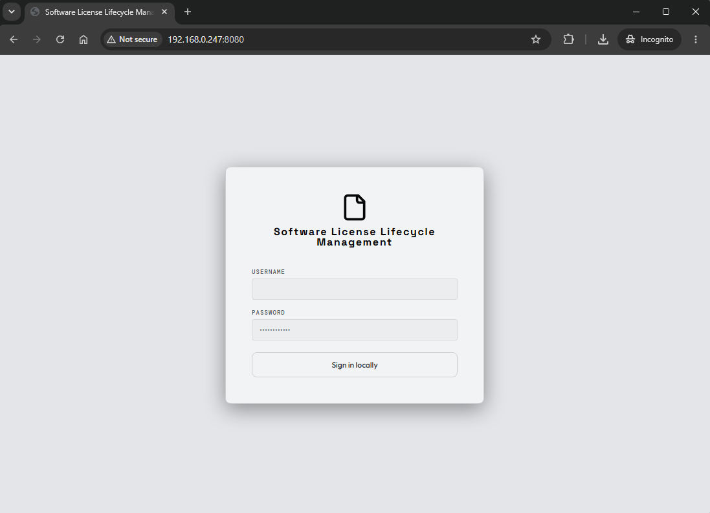
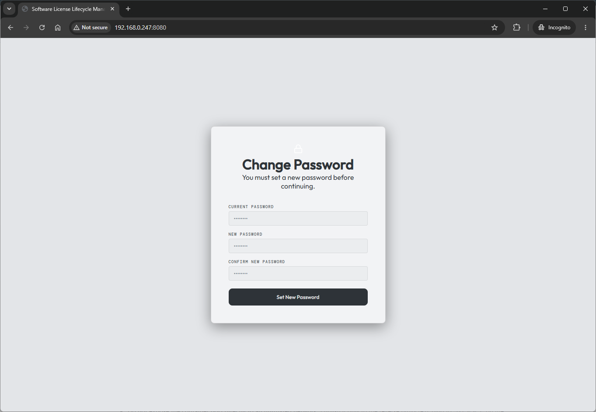
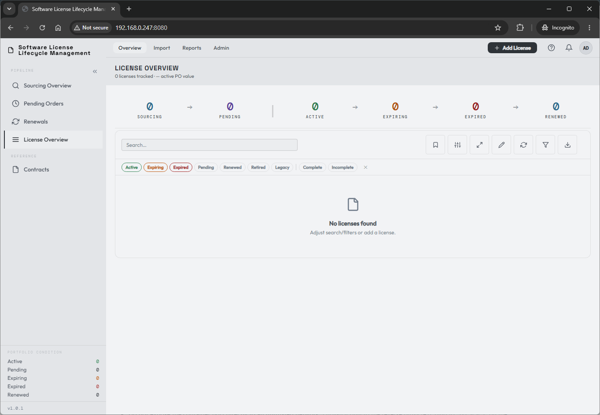
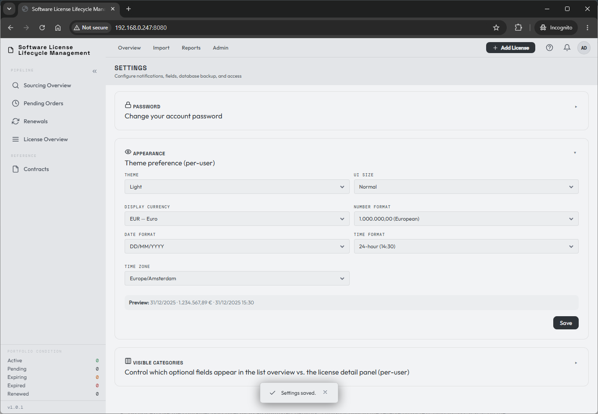

# First launch, login & admin setup

If the installation steps were successful and your server is reachable from your local machine, you can now browse to its URL on the port your container is configured for. You should reach the LicenseTrack sign-in screen:

## Sign in

Log in with the username **`admin`** and the temporary admin password you set in your `.env`. You will immediately be prompted to change it:

Set and save your new password. This is your **break-glass admin password** for the installation — store it somewhere safe.

Log in with the new password and the setup is complete.

## Make it yours

Feel free to explore the tool — get a feel for the **admin settings** (top bar) or personalize your own **user settings** (top right).

I recommend going into your personal settings and adjusting the appearance to your liking. Display currency, number format, UI size, time zone, and time and date format are all configured per user here.

Congratulations — you can now manage your first software licenses in the tool.

[:material-arrow-right: Importing your first licenses](../first-licenses/importing.md)

