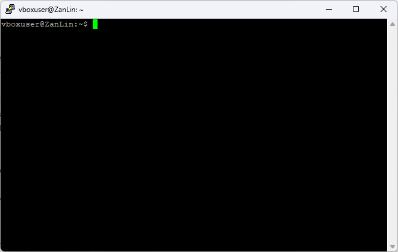
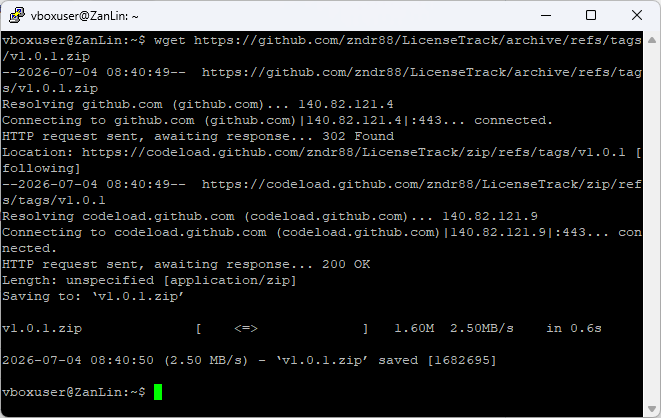
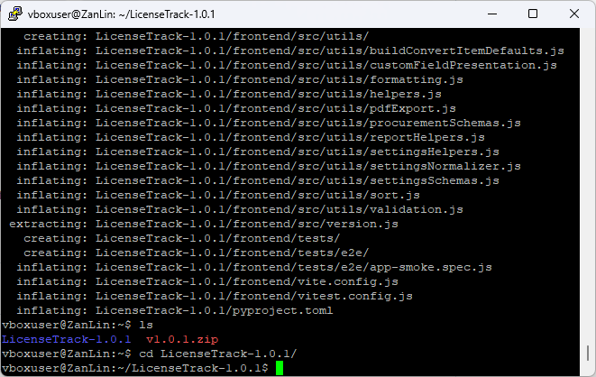
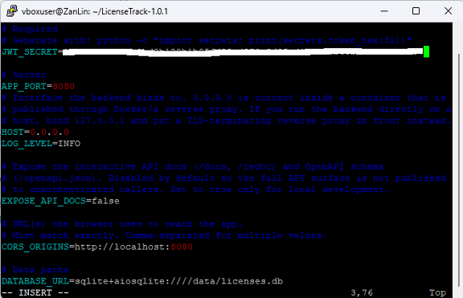
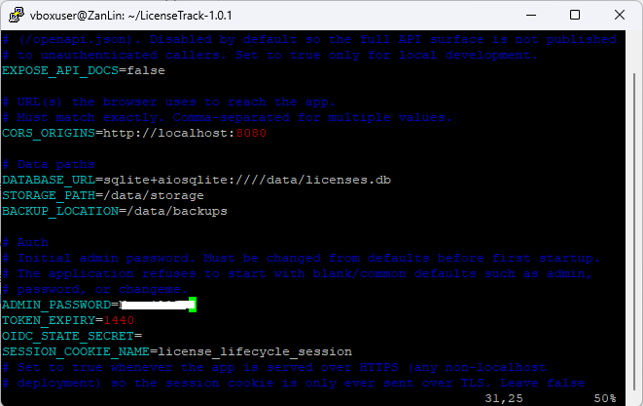
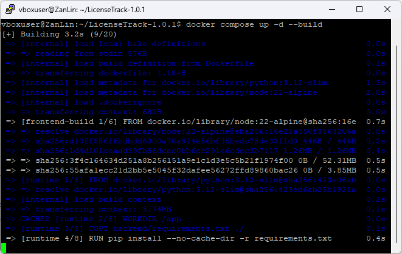
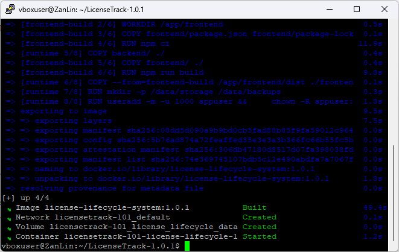
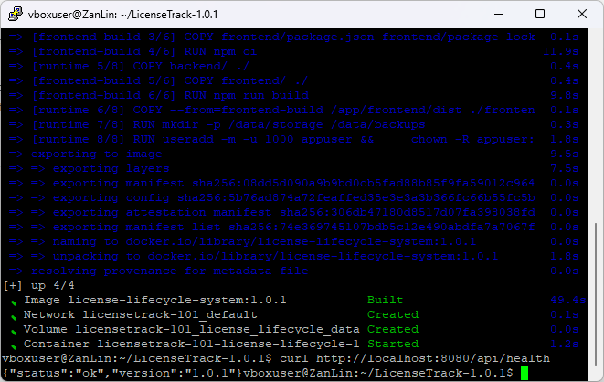

# Installation

For this example installation I am using an **Ubuntu 22.04 LTS** server, accessed over SSH with [PuTTY](https://www.putty.org/). Any Linux host with Docker (or Podman) will work.

## 1. Access your server

Connect to your machine through your own means and move to the working folder where you want LicenseTrack to live. In this example that is the user's home directory.



## 2. Download the latest release

Grab the latest release from GitHub. Here I use `wget`:

```bash
wget https://github.com/zndr88/LicenseTrack/archive/refs/tags/v1.1.17.zip
```

!!! note "Always use the current latest version"
    The commands here use `v1.1.17`. Check the [latest release](https://github.com/zndr88/LicenseTrack/releases/latest) and substitute its version tag throughout. Some screenshots on this page were captured on an earlier version — the look and feel is unchanged, only the version number differs.



## 3. Unzip and enter the folder

```bash
unzip v1.1.17.zip
cd LicenseTrack-1.1.17
```



## 4. Create your environment file

Create your own `.env` from the provided example:

```bash
cp .env.example .env
```

Generate a JWT secret:

=== "Linux / macOS"

    ```bash
    openssl rand -hex 32
    ```

=== "Windows PowerShell"

    ```powershell
    -join ((0..31) | ForEach-Object { '{0:x2}' -f (Get-Random -Max 256) })
    ```

Copy that value somewhere safe, then open the `.env` file in the editor of your choice (I prefer `vi`) and paste it in as your `JWT_SECRET`.



Change any other setting you like — for this example we keep the defaults. Scroll down to **`ADMIN_PASSWORD`** and set a non-standard first-time password. You will be required to change it on first login.

!!! warning "Startup rejects weak values"
    The app refuses to start if `JWT_SECRET` is missing or unsafe, or if `ADMIN_PASSWORD` is blank or a common default such as `admin`, `password`, or `changeme`. Pick a real password here.



Save and exit the file.

!!! danger "Keep your `.env` private"
    Your `.env` holds your JWT secret and admin password. Never commit it to source control or share it.

## 5. Launch

We are ready to launch. This example uses Docker (Podman works too):

```bash
docker compose up -d --build
```



Wait for it to finish — it downloads the dependencies and builds the image, so the first run takes a few minutes.



## 6. Verify

Once the stack is up, confirm the API is healthy:

```bash
curl http://localhost:8080/api/health
```

You should get back:

```json
{"status":"ok"}
```



Once verified, you can log off the server. The next steps happen from your local machine.

!!! tip "Deploying for real?"
    This walkthrough gets you a working instance with default settings. Before exposing LicenseTrack beyond your own machine — HTTPS, reverse proxy, CORS, the full configuration reference — read [Production deployment &amp; hardening](../operations/deployment.md).

<div class="page-nav" markdown>
[:material-arrow-right: First launch &amp; login](first-login.md)
</div>
