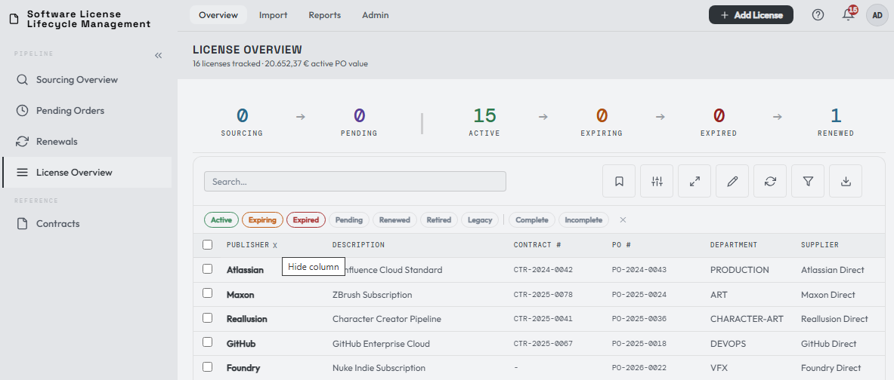
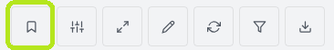
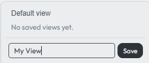
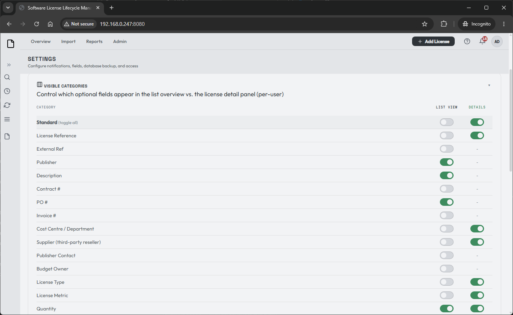
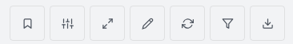

# Dashboard & key views

You've imported your licenses and set up a working renewal process. Now let's walk through the **License Overview** dashboard and the features that make it your day-to-day home.

By default the license table shows quite a few columns — realistically you won't always need all of them.

## Arrange your columns

You can drag any column to a position you prefer and remove the ones you don't need. Hover your mouse over a column name and an **X** appears — click it to hide that column.

The toolbar's **Column categories** button also lets you show or hide Standard, Advanced, Computed, and Custom Field columns without leaving the dashboard.

## Save your views

Once you've arranged the table, save it using the **Saved Views** menu (the bookmark icon in the toolbar):

Give the view a name and save it:

In this example I arranged the columns for a quick overview and saved them. You can keep multiple views and build your own functional ones — for example a view that shows only **Subscriptions** or **Perpetual** licenses, or one that focuses on value. Choosing **Default view** reverts to a sensible built-in layout (note this is not the full list of columns).

## The full column list

Your personal user settings hold a large list of **35 categories**, each of which can be turned into its own column in the list view. Some of these can also be toggled on or off for the License Details panel.

The dashboard toolbar exposes the list-view side for quick view building. My Settings remains the full editor, including fields that can also be toggled on or off for the License Details panel.

!!! tip
    If you ever lose track of a column, or want to experiment with your views, this settings page is the place to do it — nothing is permanently gone, just toggled off.

## Sort and filter the displayed values

Click a sortable column header to switch between ascending and descending
order. Sorting follows what the column means on screen: dates and timestamps
use chronological order, **Total PO Value** uses the whole PO value,
**Expiration** follows lifecycle urgency, and number, date, boolean, and text
custom fields use their declared type. Missing values stay at the end in both
directions. A header that has no supported sort value remains draggable but
does not show sort behavior.

Turn on **Show column filters** to filter individual displayed fields alongside
the normal search and status filters. Creator, quantity, notice-date, and custom
field filters follow the same display values used in the table. Numeric filters
use your selected number format.

Use **Column Categories** to choose Standard, Advanced, Computed, and Custom
Field columns, including the document-count **Docs** column. Bulk selection is
limited to the displayed page and is cleared when filters or pagination hide
the selected rows. Search, filter, saved-view, and page-size changes return the
table to a valid page instead of leaving an empty out-of-range view.

## The toolbar buttons

The leftmost icon is the **Saved Views** bookmark covered above. The remaining buttons, from left to right:

| Button | What it does |
|--------|--------------|
| **Toggle pipeline** | Hides/shows the pipeline section at the top of the page. *Not saved.* |
| **Full view** | Hides the pipeline section and collapses the side menu for a more full-screen view. *Saved.* |
| **Inline Edit** | Quick-edit certain license details without opening the License Details panel. |
| **Refresh view** | Refreshes the current view. |
| **Column categories** | Shows or hides groups of list columns while you build a view. Changes are saved to your personal settings immediately. |
| **Show column filters** | Enables the advanced filter, which can be combined with your saved views. |
| **Export CSV** | Exports your license list — choose between your current view or the full data set. |

[:material-arrow-right: Operations](../operations/index.md)

